# Python 数据分析

## 一、`Python`数据分析概述

### 1. 数据分析的概念、流程以及应用

#### ==Ⅰ -数据分析的概念==

> **数据分析**
>
> ① 概念：数据分析是指选用适当的分析方法对收集来的大量数据进行分析、提取有用的信息和形成结论，对数据加以详细研究和概况总结的过程
>
> ② 广义的数据分析包括**狭义的数据分析**和**数据挖掘**。
>
> > 数据挖掘是指从大量的、不完全的、有噪音的、模糊的、随机的实际应用数据当中，通过应用的聚类模型、分类模型、回归和关联规则等技术，挖掘潜在价值的过程

#### Ⅱ -数据分析的流程

> ① 需求分析
>
> ② 数据获取
>
> ③ 数据预处理
>
> ④ 分析与建模
>
> ⑤ 模型评价与优化
>
> ⑥ 部署

#### Ⅲ -数据分析的应用

> ① 客户与营销分析
>
> ② 业务流程优化
>
> ③ 完善执法
>
> ④ 网络安全
>
> ⑤ 优化机器和设备性能
>
> ⑥ 改善日常生活
>
> ⑦ 医疗卫生与生命科学

### 2. 数据分析工具

#### Ⅰ -常用工具

>① **Python**
>
>② R语言
>
>③ Matlab

#### ==Ⅱ -`Python`数据分析==

##### ① 优势

> * 语法精练简单
>
> * 功能强大的库
>
> * 功能强大
>
> * 不仅适用于研究和原型构建，同时也适用于构建生产系统
>
> * `Python`是一门胶水语言。`Python`可以通过多种方式与其他语言组织粘连，调用其他语言程序。

##### ② ==常见的类库==

> * **`NumPy`**
>
> * **`Pandas`**
>
> * **`Matplotlib`**
>
> * **`Sklearn`**
>
> * 其他

## 二、`NumPy`数值计算

### 1. `NumPy` 多维数组

#### ==Ⅰ-数组创建==

##### ① `array()`函数创建

>* 一维列表
>
>  ~~~python
>  a1 = np.array([1, 2, 3, 4, 5])
>  print(a1)
>  # [1 2 3 4 5]
>  ~~~
>
>* 二维列表
>
>  ~~~python
>  a2 = np.array([[1, 2, 3], [4, 5, 6]])
>  print(a2)
>  #[[1 2 3][4 5 6]]
>  ~~~
>
>* 字符串
>
>  ~~~python
>  a3 = np.array('python')
>  print(a3)
>  # python
>  ~~~
>
>* 元组
>
>  ~~~python
>  a4 = np.array((1, 2, 3))
>  print(a4)
>  #[1 2 3]
>  ~~~
>
>* 字典
>
>  ~~~python
>  a5 = np.array({'zhang': 12, 'huang': 25})
>  print(a5)
>  #{'zhang': 12, 'huang': 25}
>  ~~~

##### ② 创建特殊的数组

> | 函数                         | 描述                     |
> | ---------------------------- | ------------------------ |
> | ones()         ones_like()   | 指定形状的全1数组        |
> | zeros()        zeros_like()  | 指定形状的全0数组        |
> | empty()      empty_like()    | 指定形状的没有具体值数组 |
> | eye()            indentity() | N*N单位矩阵              |
>
> ~~~python
> import numpy as np
> b1 = np.ones((3, 4))
> print(b1)
> 
> b2 = np.ones_like(b1)
> print(b2)
> 
> b4 = np.eye(4)
> print('b4=', b4)
> ~~~
>
> 

##### ③ 从数值范围创建数组

###### （1） `arange()`函数

> `arange()`函数根据`start`和`stop`指定的范围`[start,stop)`，根据步长`step`，生成数组对象
>
> ~~~python
> # np.arange(start,stop,step,dtype)
> # dtype指定数组返回的数据类型
> c1 = np.arange(1,5,2)
> print(c1)
> # [1 3]
> ~~~

###### （2）`linspace()`函数

> `linspace()`函数生成一个等差数列构成的一维数组
>
> 参数`endPoint`是布尔类型，控制数组是否包括`stop`值
>
> 参数`retstep`是布尔类型，控制返回结果是否显示间距
>
> ~~~~python
> # np.linspace(start,stop,num,endpoint,retstep,dtype)
> c2 = np.linspace(1, 50, 50, True, True)
> print(c2)
> ~~~~
>
> 

###### （3）`logspace()`函数

> `logspace()`函数生成一个==对数运算的等比数列==构成的一维数组
>
> 参数`endPoint`是布尔类型，控制数组是否包括`stop`值
>
> 参数`base`是对数的底数
>
> ~~~~python
> # np.logspace(start,stop,num,endpoint,base,dtype)
> c3 = np.logspace(1, 10, 10, True, 10)
> print(c3)
> ~~~~
>
> 

##### ④ 使用`asarray()`函数创建数组

> `asarray()`函数可以把列表，元组等任意形式参数转化为`NumPy`数组
>
> `tolist()`函数可以转化为`Python`列表
>
> ~~~python
> d1 = [1, 3, 5, 7, 9]
> d2 = np.asarray(d1)
> print(d2)
> #[1,3,5,7,9]
> ~~~

##### ⑤ 创建随机数数组

`Numpy`的随机数函数在`Numpy.random`模块中，==因此调用相关函数需要加上**`random`**==`

###### （1）`rand()`函数

> `rand()`函数生成**指定形状**，服从分布在[0,1)之间的随机数数组
>
> ~~~python
> a = np.random.rand(2, 2, 3)
> print(a)
> ~~~
>
> 

###### （2）`uniform()`函数

> `uniform()`函数生成**指定形状**内，服从**指定区间**之间的随机数数组
>
> ~~~python
> b = np.random.uniform(4, 5, (2, 2, 2))
> print(b)
> ~~~
>
> 

###### （3）`randn()`函数

> `randn()`函数生成**指定形状**内，服从**标准正态分布**的随机数数组

###### （4）`normal()`函数

> `normal()`函数生成**指定形状**内，服从**指定正态分布**的随机数数组
>
> 默认是标准正态分布，`size`不设置返回符合指定正态分布的一个随机数
>
> ~~~python
> # np.random.normal(loc,scale,size)
> c = np.random.normal(1,2,(2,2))
> print(c)
> ~~~

###### （5）`random()`函数

> `random()`函数生成**指定形状**内，[0,1)之间均匀抽样的数组

###### （6）`randint()`函数

> `randint()`函数生成**指定形状**内，**指定区间**之间均匀抽样的`int`型数组
>
> ~~~python
> # np.random.randint(low,high,size,dept)
> c = np.random.randint(1,2,(2,2))
> print(c)
> ~~~
>
> 

#### Ⅱ -数组对象属性

| 属性     | 描述                             |
| -------- | -------------------------------- |
| ndim     | 秩                               |
| shape    | 数组的维度                       |
| size     | 元素总个数                       |
| dtype    | 数据类型                         |
| itemsize | 元素的字节大小                   |
| nbytes   | 数组的存储大小 = size * itemsize |
| T        | 数组的转置                       |
| flat     | 迭代器                           |

~~~ python
a = np.array([np.arange(3), np.linspace(3, 5, 3)])
print(a)
print(a.T)
print(a.ndim)
print(a.shape)
for item in a.flat:
    print(item)
~~~

#### Ⅲ -数组数据类型

##### ① `dtepy`指定数据类型

> `NumPy`数组创建时，可以通过`dtype`参数指定数据类型

##### ② `astype()`转换数据类型

> `astype()`函数转换数据类型
>
> * `astype()`函数会创建一个新的数组，不会改变原数组的数据类型
> * 浮点数小数部分直接舍去，不会进行四舍五入
>
> ~~~python
> b = np.array([1.1, 2.2, 3.3, 4, 5])
> c = b.astype(int)
> print(b)
> print(c)
> 
> # [1.1 2.2 3.3 4.  5. ]
> # [1 2 3 4 5]
> ~~~

### 3. 数组索引与切片

#### Ⅰ-数组索引

> ~~~python
> # a[i][j] = a[i, j]
> import numpy as np
> a = np.arange(12).reshape(3, 4)
> print(a[0][1])
> print(a[0, 1])
> # 1
> ~~~

#### Ⅱ -数组切片

> 一维数组切片：`[starting_index,ending_index,step]`
>
> 二维数组切片：` X[s0:e0,s1:e1]`
>
>  这是最通用的切片操作，表示取 第0维 的第 s0 到 e0 个元素，继续取 第1维 的第 s1 到 e1 个元素（左闭右开）
>
> ~~~python
> a = np.arange(12).reshape(3, 4)
> print(a)
> print(a[0:2][1:3])
> ~~~

#### Ⅲ -布尔型索引

> ~~~python
> print('布尔索引')
> print(a > 5)
> print(a[a > 5])
> ~~~
>
> 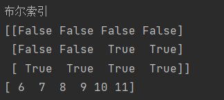

### 5.线性代数

#### Ⅰ -数组相乘

##### ① `dot()`函数

> `dot()`函数计算两个数组的**矩阵乘积**
>
> ~~~python
> import numpy as np
> 
> a = np.arange(3)
> b = np.arange(3)
> c = np.dot(a, b)
> print('c=', c)
> 
> a2 = np.arange(1, 5).reshape(2, 2)
> b2 = np.arange(5, 9).reshape(2, 2)
> c2 = np.dot(a2, b2)
> print('c2=', c2)
> 
> ~~~
>
> 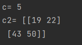

##### ② `vdot()`函数

>  `vdot()`函数计算两个数组的**矩阵点积**
>
> ~~~python
> print('np.vdot(a,b)=', np.vdot(a, b)) # 5
> print('np.vdot(a2,b2)=', np.vdot(a2, b2)) #70
> ~~~

#### Ⅱ -矩阵行列式

> `numpy.linalg.det()`函数计算矩阵的行列式
>
> ~~~python
> a3 = np.arange(1, 5).reshape(2, 2)
> print(np.linalg.det(a3)) #-2.0000000000000004
> ~~~

#### Ⅲ -逆矩阵

> `numpy.linalg.inv()`函数计算矩阵的逆矩阵
>
> ~~~python
> a = np.array([[1, 2], [3, 4]])
> print(np.linalg.inv(a))
> #[[-2.   1. ]
>  #[ 1.5 -0.5]]
> ~~~

#### Ⅳ -线性方程组

> `numpy.linalg.solve()`函数求解线性方程组
>
> ~~~python
> a = np.mat("1 1 1;0 2 5;2 5 -1")
> b = np.array([6, -4, 27])
> x = np.linalg.solve(a,b)
> print('x=',x) # x= [ 5.  3. -2.]
> ~~~

#### Ⅴ -特征值和特征向量

> `numpy.linalg.eigvals()`函数求解矩阵的特征向量
>
> `numpy.linalg.eig()`函数求解矩阵的特征向量与特征值
>
> ~~~python
> a = np.array([[1, -1], [2, 4]])
> e = np.linalg.eigvals(a)
> print('e=',e)
> e,v = np.linalg.eig(a)
> print('v=',v)
> # e = [2. 3.]
> # v = [[-0.70710678  0.4472136 ]
> # [ 0.70710678 -0.89442719]]
> ~~~

##  三、`Matplotlib`数值计算

### 1. 线形图

#### Ⅰ -绘制线形图

> `matplotlib.pyplot.plot()`
>
> ~~~python
> import numpy as np
> import matplotlib.pyplot as plt
> 
> x = np.linspace(-np.pi, np.pi, 250)
> y = np.sin(x)
> plt.plot(x, y)
> plt.plot([0.5, 1, 1.5, 2])
> plt.show()
> ~~~
>
> 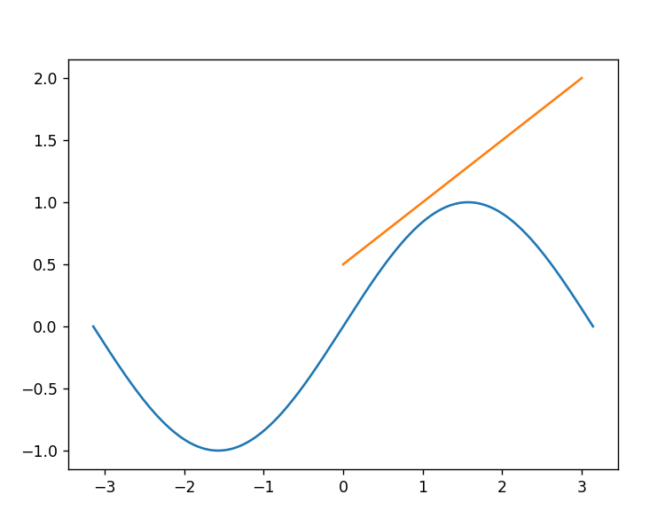

#### Ⅱ -参数设置

> | 属性      | 意义       |
> | --------- | ---------- |
> | color     | 颜色       |
> | linestyle | 线形设置   |
> | marker    | 坐标点设置 |
> | linewidth | 线宽设置   |
>
> ~~~python
> x = np.linspace(-np.pi, np.pi, 250)
> y = np.sin(x)
> plt.plot(x, y, color='red', linestyle='-.', linewidth=2, marker='*')
> ~~~
>
> 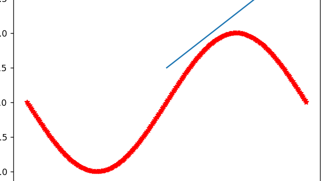

### 5. 绘制三维图形

#### Ⅰ -三维曲线图

> ~~~python
> import numpy as np
> import matplotlib.pyplot as plt
> ax = plt.axes(projection='3d')
> x = np.linspace(-np.pi, np.pi, 250)
> y = np.sin(x)
> z = np.cos(x)
> ax.plot3D(x, y, z)
> plt.show()
> ~~~
>
> 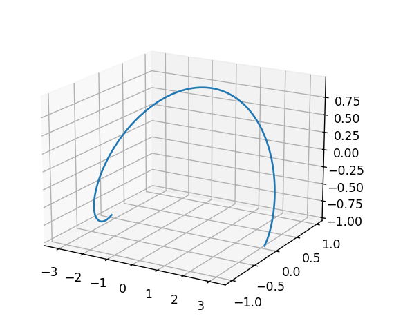

#### Ⅱ -三维散点图

> `ax.scatter(x,y,z,c='blue')`函数绘制
>
> ~~~python
> import numpy as np
> import matplotlib.pyplot as plt
> 
> # fig = plt.figure()
> ax = plt.axes(projection='3d')
> x, y, z = np.random.random(500), np.random.random(500), np.random.random(500)
> ax.scatter(x, y, z)
> plt.show()
> ~~~
>
> 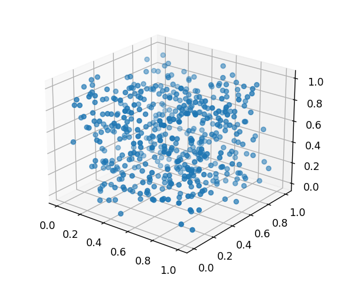

#### Ⅲ -曲面图

> `ax.plot_surface(x,y,z)`函数绘制
>
> ~~~python
> import numpy as np
> import matplotlib.pyplot as plt
> 
> # fig = plt.figure()
> ax = plt.axes(projection='3d')
> x = y = np.linspace(-2.048, 2.048, 100)
> x, y = np.meshgrid(x, y)
> z = 100 * (y - x ** 2) ** 2 + (1 - x) ** 2
> ax.plot_surface(x, y, z)
> plt.show()
> 
> ~~~
>
> 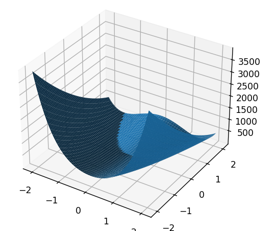

#### Ⅳ -等高线

> `ax.contour(x,y,z)`函数绘制等高线

## 四、`Pandas`数据分析

### 1. `Pandas`数据结构

> `Pandas`有三种数据结构：**系列**、**数据帧**和**面板**，这些数据结构都建立在`NumPy`数组基础上

#### Ⅰ -`Series`（系列）

> 构造函数：`Pandas.series(data, index, dtype, copy)`
>
> | 参数  | 描述     |
> | ----- | -------- |
> | data  | 数据     |
> | index | 索引     |
> | dtype | 数据类型 |
> | copy  | 复制数据 |
>
> ~~~python
> import numpy as np
> import pandas as pd
> 
> data = np.array(['a', 'b', 'c', 'd', 'e'])
> s1 = pd.Series(data)
> print('默认索引：')
> print(s1)
> ~~~
>
> 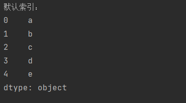
>
> ~~~python
> s2 = pd.Series(data, index=[100, 101, 102, 103, 104])
> print('设置索引s2')
> print(s2)
> print(s2.index)
> # Int64Index([100, 101, 102, 103, 104], dtype='int64')
> ~~~
>
> 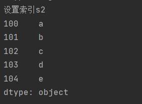

#### Ⅱ -数据帧

> 数据帧`(DataFrame)`是一个具有异构数据的二维数组，其特点是**异构数据**、**大小可变**、**数据可变**

##### ① 创建空数据帧

> ~~~python
> df = pd.DataFrame()
> print('创建空的数据帧：')
> print(df)
> ~~~
>
> 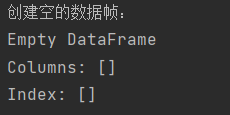

##### ② 数据帧

> ~~~python
> data = np.arange(11, 15)
> df1 = pd.DataFrame(data)
> print('df1=')
> print(df1)
> 
> data = {'name': ['xiaoming', 'xiaohong', 'xiaohua'], 'sex': ['m', 'w', 'w']}
> df3 = pd.DataFrame(data)
> print(df3)
> ~~~
>
> 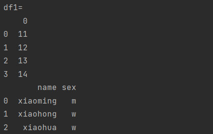

#### Ⅲ -面板

### 2.`DataFrame`的基本功能

> | 属性或方法 | 描述            |
> | ---------- | --------------- |
> | T          | 转置            |
> | axes       | 轴序列          |
> | dtype      | 数据类型        |
> | empty      | 是否为空        |
> | ndim       | 数组维度大小    |
> | shape      | 形状            |
> | size       | 元素数量        |
> | values     | 数据值NumPy表示 |
> | head()     | 返回开头前n行   |
> | tail()     | 返回结尾后n行   |
>
> 

### 6. `Pandas`数据运算

#### Ⅰ -算术运算

##### ① `Series`算术运算

> 如果存在相同的索引以及列名，则进行计算，没有则引入缺失值
>
> ~~~python
> import numpy as np
> import pandas as pd
> 
> s1 = pd.Series([1, 2, 3], index=[1, 2, 3])
> s2 = pd.Series([3, 4, 5], index=[1, 2, 3])
> s3 = pd.Series([3, 4, 5], index=[1, 2, 4])
> print('相同索引')
> print(s1+s2)
> print('不同索引')
> print(s1+s3)
> ~~~
>
> 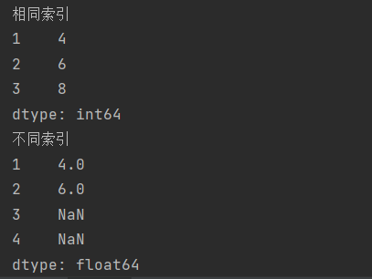

##### ② 数据帧算术运算

> 如果存在相同的索引以及列名，则进行计算，没有则引入缺失值
>
> ~~~python
> import numpy as np
> import pandas as pd
> 
> df1 = pd.DataFrame({'a1': [1, 2], 'b1': [1, 2]})
> df2 = pd.DataFrame({'a1': [1, 2], 'b1': [1, 2]})
> df3 = pd.DataFrame({'a1': [1, 2], 'c1': [1, 2]})
> print('相同索引')
> print(df1 + df2)
> print('不同索引')
> print(df1 + df3)
> ~~~
>
> 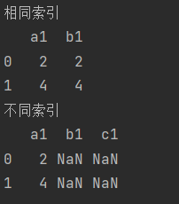

##### ③ 系列和数据帧计算

> 如果存在相同的索引以及列名，则进行计算，没有则引入缺失值
>
> ~~~python
> s1 = pd.Series([1, 2, 3], index=[1, 2, 3])
> df1 = pd.DataFrame({1: [1, 2], 2: [1, 2]})
> print(s1 + df1 )
> ~~~
>
> 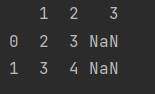

#### Ⅱ -函数应用与映射关系

> | 函数方法 | 描述                                |
> | -------- | ----------------------------------- |
> | pipe()   | 其他函数套用在整个DataFrame         |
> | map()    | 其他函数套用在整个Series            |
> | apply()  | 其他函数套用在DataFrame的行和列上面 |

#### Ⅲ -排序

> `ascending`：`True`升序排列，`False`降序
>
> `axis`：0按照行排列，1按照列排序
>
> | 函数方法     | 描述     |
> | ------------ | -------- |
> | sort_index() | 索引排序 |
> | sort_value() | 值排序   |

#### Ⅳ -迭代

#### Ⅴ -唯一值与去重

> `unique`：去重
>
> `value_counts`：计算每一个元素个数

